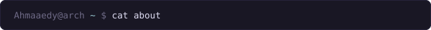
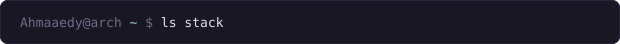
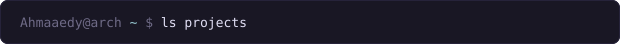
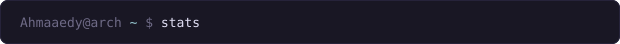
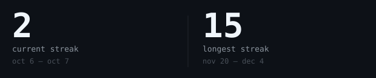
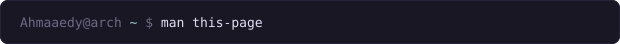

<h1>Ahmad El Yakubu</h1>

[linkedin](https://www.linkedin.com/in/ahmaedy/) &nbsp;·&nbsp;
[x](https://x.com/ElyakubuAhmad) &nbsp;·&nbsp;
[email](mailto:ahmadelyakubu@gmail.com)

> Electrical Engineering student at ABU, Zaria, Nigeria. 
> Confused by hardware and software in equal measure.

My first project was a chatbot I built at 11. It was bad. I've been 
building ever since, learning mostly by brute-force trial and error, and 
later through Turing Award winner Leslie Lamport's line: *"Coding is to 
programming what typing is to writing."* The syntax is the easy part. The 
logic is the craft.

Right now that's **[Zars](https://github.com/Ahmaaedy/zars)**, an on-device 
local assistant with a decision-model layer. It's built to be faster than 
the alternatives by deciding instead of guessing.

Off the keyboard, or at least adjacent to it: **Arch Linux, btw**, deep in 
the ricing scene, because if my desktop doesn't look intentional, something's 
wrong. A homelab server running my research scripts and storage, where I'm the 
only one on call when it breaks. A Rubik's cube PB of 1:43, not fast, still 
proud. And chess, played badly, with great confidence.

My code isn't distributed-systems-proof yet. My ego is.

<samp>python &nbsp; react &nbsp; html &nbsp; css &nbsp; javascript &nbsp; linux &nbsp; rust (learning)</samp>

**[Damha](https://github.com/Ahmaaedy/damha)** &nbsp;·&nbsp; <samp>python, telethon, ctrader, metatrader5</samp> 
Trading bot that reads Telegram and forum chatter, pulls out SL/TP levels, 
and has AI vet each call before firing a market order. Variants add 
MetaTrader5 support, desktop toasts, and email alerts.

**[Pharmx](https://github.com/Ahmaaedy/pharmx)** &nbsp;·&nbsp; <samp>fastapi, react, tailwind</samp> 
Medication safety checker. Give it a drug list and labs, and it returns one 
severity-ranked report of interactions and renal-dosing risks.

**[Campus Guardian AI](https://github.com/Ahmaaedy/cga)** &nbsp;·&nbsp; <samp>react, express, capacitor, gemma</samp> 
Safety app for ABU: complaint submission, one-tap emergency SMS, and an 
on-device LLM that answers university questions without needing a server.

**[StreamCBT](https://github.com/Ahmaaedy/streamcbt)** &nbsp;·&nbsp; <samp>html, css, javascript</samp> 
Free CBT prep for university students: timed tests, instant scored review, 
course handbooks, and a video lecture library. A static site, no build step.

**[video-editing-agent](https://github.com/Ahmaaedy/video-editing-agent)** &nbsp;·&nbsp; <samp>python, streamlit, whisper, gpt-4</samp> 
Upload a video and a script, and it transcribes with word-level timestamps, 
picks the best takes, and cuts stutters and repeats.

Every graphic here is generated, not embedded from anyone else's server. 
The stat graphics and these section headings are drawn by 
[`scripts/generate.py`](scripts/generate.py), run by 
[a scheduled action](.github/workflows/stats.yml) straight from the GitHub 
GraphQL API, once a day, committing only what changed.

They animate with SMIL inside the SVG, because GitHub strips scripts from 
READMEs, and since nothing loads from a third party, nothing here can 
rate-limit or go dark.

Language totals cover public repositories only. `year.svg` draws one 
character per day: `.` `:` `+` `#` `@`, quiet to loud.
